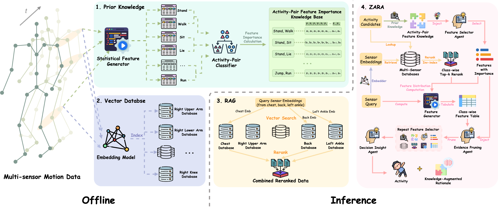

<h1 align="center"><strong> ZARA</strong></h1>
<h1 align="center"><strong> Zero-shot Motion Time-Series Analysis via Knowledge and Retrieval Driven LLM Agents</strong></h1>
  <p align="center">
    <a href='https://scholar.google.com/citations?user=EVOzBF4AAAAJ&hl=en' target='_blank'>Zechen Li</a>&emsp;&emsp;
    <a href='https://scholar.google.com/citations?user=haLBEWwAAAAJ&hl=en' target='_blank'>Baiyu Chen</a>&emsp;&emsp;
    <a href='https://scholar.google.com/citations?user=KwhLl7IAAAAJ&hl' target='_blank'>Hao Xue</a>&emsp;&emsp;
    <a href='https://fsalim.github.io' target='_blank'>Flora D. Salim</a>
    <br><br>
     University of New South Wales, Sydney<br/>
    <br><br>
    <a href="https://arxiv.org/abs/2508.04038">
        
    </a>
  </p>

------
📝 We are currently organizing the code and writing a detailed tutorial to help you build your own ZARA agent for human activity recognition. Stay tuned for updates!

## 🌟 Overview

**ZARA** is the first zero-shot motion time-series analysis LLM agent that combines **domain knowledge**, **multi-sensor retrieval-augmented generation**, and **multi-agent reasoning** to classify motion sensor data for human activity recognation, achieving 2.53× F1 over baselines without fine-tuning or task-specific classifiers.
<div style="text-align: center;">
    
</div>

### 🔑 Key Features

- **Plug-and-Play Zero-Shot HAR**: ZARA leverages a knowledge-enhanced, evidence-extracting Large Language Models to achieve accurate and interpretable human activity recognition.
- **Pairwise Knowledge Base**: Domain insights per activity pair.  
- **Adaptive RAG**: Multi-sensor retrieval for motion time-series classification & rationale.  
- **Classifier-Free Generalization**: 2.53× macro F1 gain over 10 baselines across 8 benchmarks, without requiring label-specific training.

## 🌍 Citation

If you find this repository useful for your research, please cite our paper:

```
@misc{li2025zarazeroshotmotiontimeseries,
      title={ZARA: Zero-shot Motion Time-Series Analysis via Knowledge and Retrieval Driven LLM Agents}, 
      author={Zechen Li and Baiyu Chen and Hao Xue and Flora D. Salim},
      year={2025},
      eprint={2508.04038},
      archivePrefix={arXiv},
      primaryClass={cs.CL},
      url={https://arxiv.org/abs/2508.04038}, 
}
```

## 📄 License

<a rel="license" href="http://creativecommons.org/licenses/by-nc-sa/4.0/"></a>
<br />
This work is under the <a rel="license" href="http://creativecommons.org/licenses/by-nc-sa/4.0/">Creative Commons Attribution-NonCommercial-ShareAlike 4.0 International License</a>.


## 📩 Contact

If you have any questions or suggestions, feel free to contact Zechen at `zechen.li(at)unsw(dot)edu(dot)au`.

